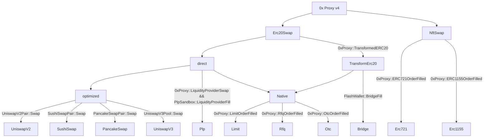
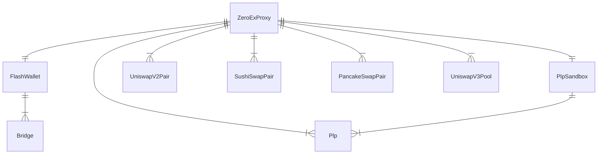
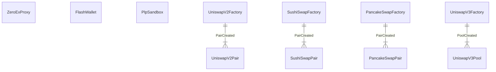
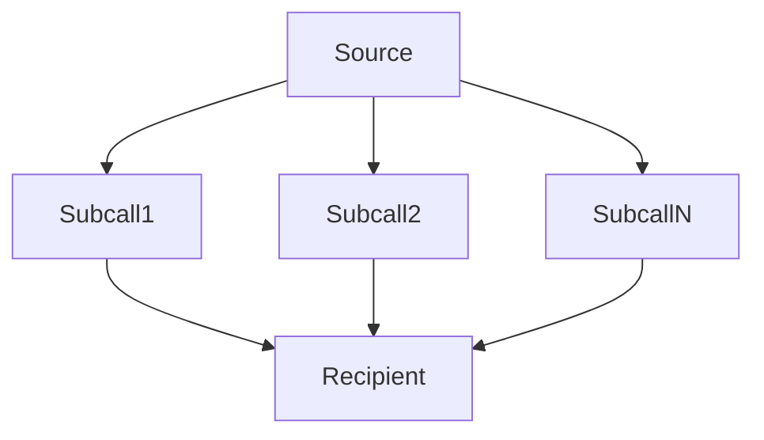
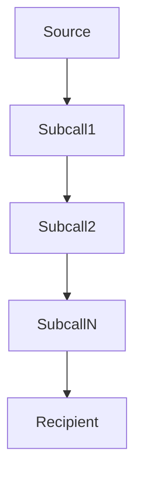
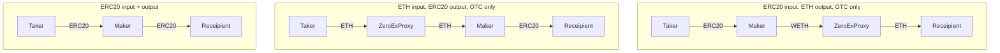
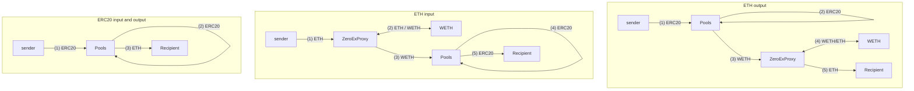
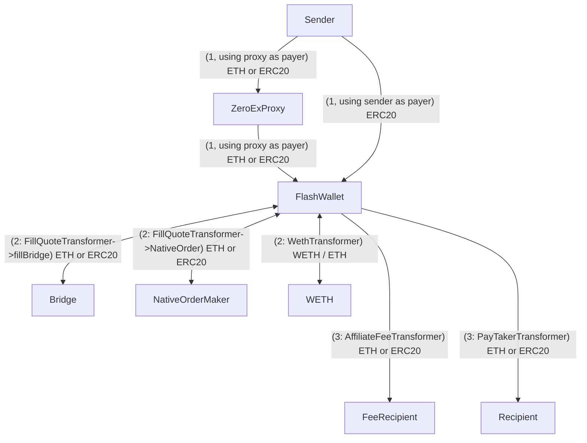
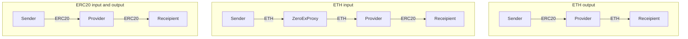

# 0x Protocol Community Subgraph

0x Protocol community subgraph. These subgraphs contain comprehensive data on the 0x protocol on all networks.

## Table of Contents

- [0x Protocol Community Subgraph](#0x-protocol-community-subgraph)
	- [Table of Contents](#table-of-contents)
	- [Subgraph Deployments](#subgraph-deployments)
	- [Usage Notes](#usage-notes)
	- [Block Diagrams](#block-diagrams)
		- [Order Types and Events](#order-types-and-events)
		- [Contract Contexts](#contract-contexts)
		- [Contract Source Spawning](#contract-source-spawning)
		- [Multiplex Feature](#multiplex-feature)
			- [BatchSell](#batchsell)
			- [MultiHopSell](#multihopsell)
		- [Token Flows](#token-flows)
			- [NativeOrder](#nativeorder)
			- [OptimizedSwap](#optimizedswap)
			- [Transform Erc20](#transform-erc20)
			- [Plugable Liquidity Provider](#plugable-liquidity-provider)
	- [Development](#development)
		- [Grafting](#grafting)
		- [Contract Addresses](#contract-addresses)
	- [Validation](#validation)


## Subgraph Deployments

| Blockchain Network | The Graph Hosted                                                                                     | The Graph Decentralized                                                                                                                          |
| ------------------ | ---------------------------------------------------------------------------------------------------- | ------------------------------------------------------------------------------------------------------------------------------------------------ |
| Ethereum Mainnet   | [Mainnet Hosted](https://thegraph.com/hosted-service/subgraph/papercliplabs/0x-protocol-mainnet)     | [Mainnet Decentralized](https://thegraph.com/explorer/subgraphs/8z2m5ieDP7gXoZM41zhQeBQ5ihh4eaNQTYLxmvS1tfM3?view=Overview&chain=arbitrum-one)   |
| Optimism           | [Optimism Hosted](https://thegraph.com/hosted-service/subgraph/papercliplabs/0x-protocol-optimism)   | [Optimism Decentralized](https://thegraph.com/explorer/subgraphs/GaGpbxRjid6qX7rtmRqWbCWhipMnqd296ru3TC8CEHXC?view=Overview&chain=arbitrum-one)  |
| Arbitrum           | [Arbitrum Hosted](https://thegraph.com/hosted-service/subgraph/papercliplabs/0x-protocol-arbitrum)   | [Arbitrum Decentralized](https://thegraph.com/explorer/subgraphs/2vqKhiDjGGC9RckYcJvJjhogvnoFW76J5kugevpGFAfY?view=Overview&chain=arbitrum-one)  |
| Base               | [Base Hosted](https://thegraph.com/hosted-service/subgraph/papercliplabs/0x-protocol-base)           | [Base Decentralized](https://thegraph.com/explorer/subgraphs/9mjM89YWHUGch4NT7T2CZ9DCCz2u1sj6FnueDDgjejBP?view=Overview&chain=arbitrum-one)      |
| Polygon            | [Polygon Hosted](https://thegraph.com/hosted-service/subgraph/papercliplabs/0x-protocol-polygon)     | [Polygon Decentralized](https://thegraph.com/explorer/subgraphs/Hz7u4jLLRyVrJHm1meTptPnyDRsYKwMHNZcDHRL7H9wz?view=Overview&chain=arbitrum-one)   |
| BNB                | [BNB Hosted](https://thegraph.com/hosted-service/subgraph/papercliplabs/0x-protocol-bnb)             | [BNB Decentralized](https://thegraph.com/explorer/subgraphs/EsYH4nwWf4EREcC5eb4hp75h8uVQKN29L73XTkscKwey?view=Overview&chain=arbitrum-one)       |
| Avalanche          | [Avalanche Hosted](https://thegraph.com/hosted-service/subgraph/papercliplabs/0x-protocol-avalanche) | [Avalanche Decentralized](https://thegraph.com/explorer/subgraphs/7VrMWA69ZgjqLY5UtacTo1rzeCbWzTnqbkSprsi3Kkp6?view=Overview&chain=arbitrum-one) |
| Fantom             | [Fantom Hosted](https://thegraph.com/hosted-service/subgraph/papercliplabs/0x-protocol-fantom)       | [Fantom Decentralized](https://thegraph.com/explorer/subgraphs/3KGwtWH7fjgv3gQj8AQm8QgBZLB5jJHcihjtbPYLpLdA?view=Overview&chain=arbitrum-one)    |
| Celo               | [Celo Hosted](https://thegraph.com/hosted-service/subgraph/papercliplabs/0x-protocol-celo)           | [Celo Decentralized](https://thegraph.com/explorer/subgraphs/9JdP8udBnHezjCRdimW8ehCtcmwRxFGBhZVxLYUMW4dt?view=Overview&chain=arbitrum-one)      |

## Usage Notes

- Each element in the schema is well documented. You can view the docs directly in the [schema file](./schema.graphql), or The Graph also displays these in their graphql interface.
- We provided [example queries](./exampleQueries/) to help people get started. These can also be seen in The Graphs playground.
- As part of validation, we wrote some [Jupyter notebooks](./validation/notebooks) which query the subgraphs in Python. In the [historical notebook](./validation/notebooks/historical.ipynb) we plot a lot of historical data, which can be useful to help visualize some of the subgraph the data. 
- One limitation of subgraphs is the inability to track native asset transfers (ex. ETH) in internal calls. This means we cannot accurately do accounting of complex swaps which use native assets during or at the end of the swap.
- We try our best to infer the sender, filler and recipient for each fill when they are not provided by an event, but sometimes it is not possible. This occurs for example, in cases where:
    -   An ERC20 doesn't emit Transfer events, or the event doesn't not conform to the ERC20 standard
    -   During LiquidityProviderSwap when the input token is the native asset. 
    -   During BridgeFills when the input token is ETH, and the output token gets minted (for example, ETH -> cETHv3)
- Due the the limitations of internal call native asset tracking mentioned above, we do not try to infer and assemble full swaps. Instead we provide all the fills for a transaction, and all erc20 transfer which happen within. It is possible for the querier to assemble the entire swap using this data and a 3rd party source to fill in the native transfer blanks.
-   Derived prices:
    -   Derived native asset (ex. ETH) prices are computed whenever an ERC20 fill occurs. For each token involved in the fill, the native asset price of the token is derived by looking at all token pairs with a whitelisted token (which can be assumed to have a reliable prices). Of these pairs, we find the whitelist token with the freshest native asset price and exchange rate to the token of interest. We then propagate the price through the pairs exchange rate to find the derived native asset price of the token of interest. 
    -  Derived USD prices are computed after the derived native asset price is computed by using a native asset / USD chainlink price feed.
    -  Due to the nature of how derived prices are computed, there can be a difference between the lastUpdatedBlock and the lastDerivedPriceBlock. When using derived prices, always consider lastDerivedPriceBlock to know how fresh the price is. 
- ERC20 fill roles
  - generalized to the following 3 roles and token flow
	```mermaid 
	graph TD
		source --"input token"--> filler
		filler --"output token"--> destination
	```
	- In native orders:
		-  maker is the source
		-  maker token is the input token
		-  taker is the filler 
		-  taker token is the output token
		-  it is possible that the input token doesn't actually go to the filler and instead to a recipient the filler specifies (ex batch RFQ orders), we don't explicitly try to derive this as it would require tracking and deriving another role in general (the input token recipient). See the note above about inferring roles where event data doesn't provide this information.
- Erc20Fill.feeRecipient is only used for Limit orders, we cannot accurately track fee recipients for erc20Transforms due to no events being emitted. 
- For erc20BridgeFills, the source and destination will always be the flash wallet. This is because the flash wallet is always the address that interacts with the bridge. From the perspective of the individual fill, this is accurate since the input tokens flow from the flash wallet to the filler, and the output tokens flow from filler to flash wallet. This information is what is required to assemble the entire swap for complex swaps (multihop, batch, and/or multiple transforms), see the note above about why we do not attempt to do this assembly at indexing time. 
- Historical snapshots are provided on daily and weekly intervals. Ideally these are also provided hourly, but the indexing time increase is too significant. 
- Historical snapshots are taken at the start of the interval. All historical data is reported as cumulative, interval volumes can be computed by subtracting the previous intervals value. 
- Unique users: the subgraph considers unique users as unique originating addresses of transactions to the 0x protocol. I.e for any fill, there will only be 1 "user", which is the sender of the transaction. The reason we do this is because we don't assemble entire trades, we only consider fills. Many fills source and destination are the zeroEx proxy, or the flash wallet, and the fillers are pools, so considering fill actors (source, filler, destination) would under count unique users in general.
- Aggregated volumes are provided as `volumeUsd` and `whitelistVolumeUsd`:
  - volumeUsd: input volume of all erc20s, this is likely incorrect since it includes 'shit coins' which might be price manipulated and cause a skew in overall volume. This can be used to reconstruct an accurate total volume by excluding certain tokens which are causing the errors.
  - whitelistVolumeUsd: input volume of only whitelisted erc20s, this will be an underestimate on total volume, but more accurate than volumeUsd in general. You can see what tokens are whitelisted by looking at `Erc20Token.whitelisted`, or you can view the list [here](./src/common/networkSpecific.ts).
- API key: we provide a free community API key to query the graph's decentralized network deployment, reach out to contract@paperclip.xyz to get it.	
  - Using the api key: replace [api-key] in the query url (get the query url from the deployment) with the api key

## Block Diagrams

These block diagrams provide an overview of the general functionality of the 0x protocol in the depth required for developing and understanding this subgraph.

### Order Types and Events



### Contract Contexts



### Contract Source Spawning

Top row is all the static data sources with hard coded contract addresses, below that are dynamic data sources



### Multiplex Feature

Multiplex allows composition of all order types:

```solidity
enum MultiplexSubcall {
    Invalid,
    RFQ,
    OTC,
    UniswapV2,
    UniswapV3,
    LiquidityProvider,
    TransformERC20,
    BatchSell,
    MultiHopSell
}
```

#### BatchSell 



#### MultiHopSell 



> Note that BatchSell and MultiHopSell can be composed within each other, offering even more flexibility. I.e a subcall of batch could be a multihop and visa versa.

### Token Flows

#### NativeOrder

Note: OTC is the only one that supports filling in ETH directly, others can through transforms



#### OptimizedSwap



#### Transform Erc20



#### Plugable Liquidity Provider



## Development

> Any `<network>` below is to be replaced with one of the supported networks: [mainnet, optimism, arbitrum, base, polygon, bnb, avalanche, fantom, celo]

Install dependencies

```
yarn install
```

Copy .env.example to .env and populate it

```
cp .env.example .env
```

Run code generation

```
yarn codegen
```

Build

```
yarn build:<network>
```

Deploy to the hosted network

```
yarn deploy-hosted:<network>
```

Deploy to the subgraph studio (version controlled with STUDIO_VERSION in .env)

```
yarn deploy-studio:<network>
```

Codegen, build and deploy everywhere in one command

```
yarn auto-deploy:<network>
```

Autodeploy to hosted and studio for all networks

```
yarn auto-deploy:all
```

Local mainnet development

```
# Create subgraph (only need first time)
yarn create-local

# Deploy
yarn deploy-local

# Remove
yarn remove-local
```

### Grafting

This can be added to the end of `subgraph.yaml` to graft to an existing subgraph for debugging and fixing indexing errors.
```
features:
  - grafting # feature name
graft:
  base: Qm... # subgraph ID of base subgraph
  block: 1502122 # block number
```

### Contract Addresses

-   0x addresses: https://github.com/0xProject/protocol/blob/development/packages/contract-addresses/addresses.json
-   UniswapV2: https://docs.uniswap.org/contracts/v2/reference/smart-contracts/factory
-   SushiSwap: https://docs.sushi.com/docs/Products/Classic%20AMM/Deployment%20Addresses
-   PancakeSwap: https://docs.pancakeswap.finance/developers/smart-contracts/pancakeswap-exchange/v2-contracts/factory-v2
-   UniswapV3: https://docs.uniswap.org/contracts/v3/reference/deployments
-   Chainlink price feeds: https://docs.chain.link/data-feeds/price-feeds/addresses?network=base&page=1&search=ETH+%2F+USD

## Validation

- [Validation Spreadsheet](https://docs.google.com/spreadsheets/d/1jWB7KghHDBUJVF08xxGYZ2URpdg9PqY1dRGmZZ--s6o/edit?usp=sharing): summarizes all validation
- Notebooks: these are used to extract data for the validation spreadsheet
	- [historical](./validation/notebooks/historical.ipynb): extracts and plots subgraph historical data
	- [current](./validation/notebooks/current.ipynb): extracts subgraph current data (tip)
	- [external](./validation/notebooks/external.ipynb): extracts data from external API's
