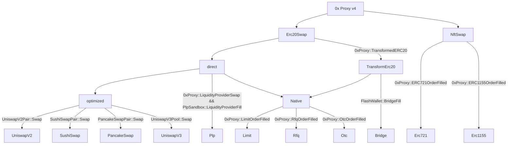
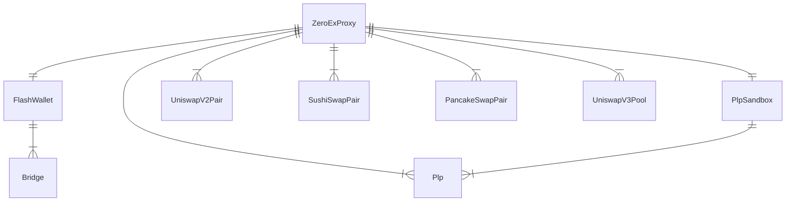
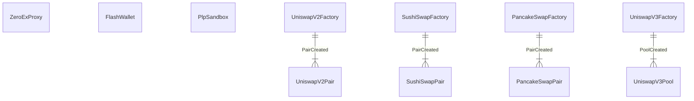
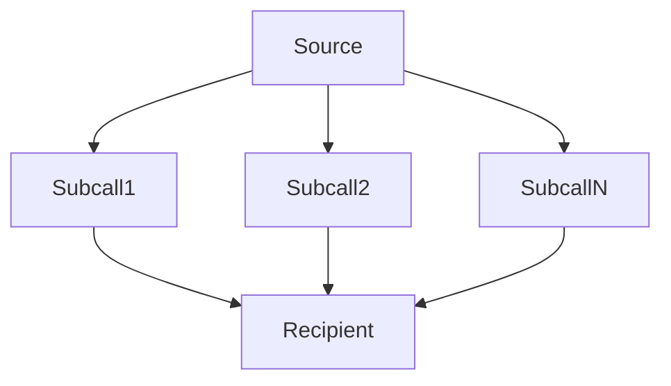
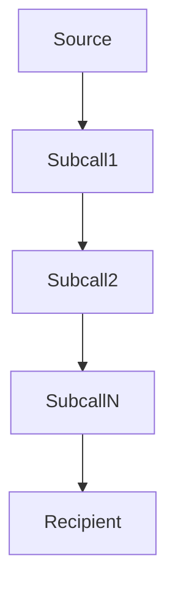
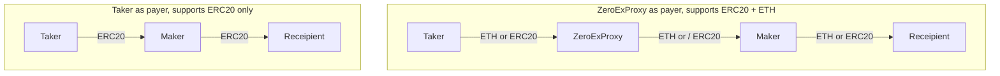
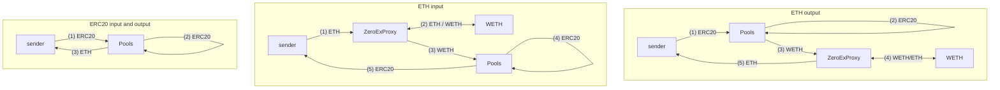
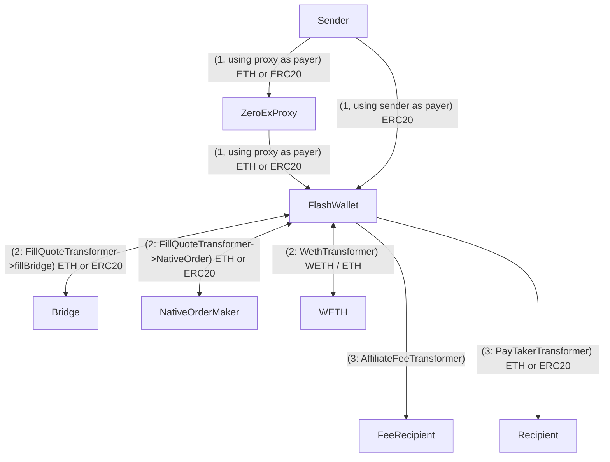
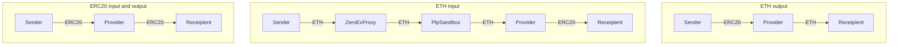

# 0x Protocol Community Subgraph

0x Protocol community subgraph. These subgraphs contain comprehensive data on the 0x protocol on all networks.

## Table of Contents

- [0x Protocol Community Subgraph](#0x-protocol-community-subgraph)
	- [Table of Contents](#table-of-contents)
	- [Subgraph Deployments](#subgraph-deployments)
	- [Usage Notes](#usage-notes)
	- [Block Diagrams](#block-diagrams)
		- [Order Types and Events](#order-types-and-events)
		- [Contract Contexts](#contract-contexts)
		- [Contract Source Spawning](#contract-source-spawning)
		- [Multiplex](#multiplex)
			- [BatchSell](#batchsell)
			- [MultiHopSell](#multihopsell)
		- [Token Flows](#token-flows)
			- [NativeOrder](#nativeorder)
			- [OptimizedSwap](#optimizedswap)
			- [Transform Erc20](#transform-erc20)
			- [Plugable Liquidity Provider](#plugable-liquidity-provider)
	- [Development](#development)
		- [Grafting](#grafting)
		- [Contract Addresses](#contract-addresses)
	- [Validation](#validation)


## Subgraph Deployments

| Blockchain Network | The Graph Hosted                                                                                     | The Graph Decentralized              | Alchemy |
| ------------------ | ---------------------------------------------------------------------------------------------------- | ------------------------------------ | ------- |
| Ethereum Mainnet   | [Mainnet Hosted](https://thegraph.com/hosted-service/subgraph/papercliplabs/0x-protocol-mainnet)     | TODO                                 | TODO    |
| Optimism           | [Optimism Hosted](https://thegraph.com/hosted-service/subgraph/papercliplabs/0x-protocol-optimism)   | TODO                                 | TODO    |
| Arbitrum           | [Arbitrum Hosted](https://thegraph.com/hosted-service/subgraph/papercliplabs/0x-protocol-arbitrum)   | TODO                                 | TODO    |
| Base               | [Base Hosted](https://thegraph.com/hosted-service/subgraph/papercliplabs/0x-protocol-base)           | TODO                                 | TODO    |
| Polygon            | [Polygon Hosted](https://thegraph.com/hosted-service/subgraph/papercliplabs/0x-protocol-polygon)     | TODO                                 | TODO    |
| BNB                | [BNB Hosted](https://thegraph.com/hosted-service/subgraph/papercliplabs/0x-protocol-bnb)             | TODO: issue deploying, not Supported | TODO    |
| Avalanche          | [Avalanche Hosted](https://thegraph.com/hosted-service/subgraph/papercliplabs/0x-protocol-avalanche) | TODO                                 | TODO    |
| Fantom             | [Fantom Hosted](https://thegraph.com/hosted-service/subgraph/papercliplabs/0x-protocol-fantom)       | TODO                                 | TODO    |
| Celo               | [Celo Hosted](https://thegraph.com/hosted-service/subgraph/papercliplabs/0x-protocol-celo)           | TODO: issues deploying               | TODO    |

## Usage Notes

-   One limitation of subgraphs is the inability to track native asset transfers (ex. ETH) in internal calls. This means we cannot accurately do accounting of complex swaps which use native assets during or at the end of the swap.
-   We try our best to infer the sender, filler and recipient for each fill when they are not provided by an event, but sometimes it is not possible. This occurs for example, in cases where:
    -   An ERC20 doesn't emit Transfer event
    -   During LiquidityProviderSwap when the input token is ETH
    -   During BridgeFills when the input token is ETH, and the output token gets minted (for example, ETH -> cETHv3)
- Due the the limitations of internal call native asset tracking mentioned above, we do not try to infer and assemble full swaps. Instead we provide all the fills for a transaction, and all erc20 transfer which happen within. It is possible for the querier to assemble the entire swap using this data and a 3rd party source to fill in the native transfer blanks.
-   Derived prices:
    -   Derived native asset (ex. ETH) prices are computed whenever an ERC20 fill occurs. For each token involved in the fill, the native asset price of the token is derived by looking at all token pairs with a whitelisted token (which can be assumed to have a reliable prices). Of these pairs, we find the whitelist token with the freshest native asset price and exchange rate to the token of interest. We then propagate the price through the pairs exchange rate to find the derived native asset price of the token of interest. 
    -  Derived USD prices are computed after the derived native asset price is computed by using a native asset / USD chainlink price feed.
    -  Due to the nature of how derived prices are computed, there can be a difference between the lastUpdatedBlock and the lastDerivedPriceBlock. When using derived prices, always consider lastDerivedPriceBlock to know how fresh the price is. 
- This [Notebook](validation/query.ipynb) contains plots for historical data, this can be useful to help query and visualize the data from the subgraph

## Block Diagrams

### Order Types and Events



### Contract Contexts



### Contract Source Spawning

Top row is all the static data sources with hard coded contract addresses, below that are dynamic data sources



### Multiplex

Multiplex allows composition of all order types:

```solidity
enum MultiplexSubcall {
    Invalid,
    RFQ,
    OTC,
    UniswapV2,
    UniswapV3,
    LiquidityProvider,
    TransformERC20,
    BatchSell,
    MultiHopSell
}
```

#### BatchSell



#### MultiHopSell



> Note that BatchSell and MultiHopSell can be composed within each other, offering even more flexibility. I.e a subcall of batch could be a multihop and visa versa.

### Token Flows

#### NativeOrder

Note: OTC is the only one that supports filling in ETH directly, others can through transforms



#### OptimizedSwap



#### Transform Erc20



#### Plugable Liquidity Provider



## Development

> Any `<network>` below is to be replaced with one of the supported networks: [mainnet, optimism, arbitrum, base, polygon, bnb, avalanche, fantom, celo]

Install dependencies

```
yarn install
```

Copy .env.example to .env and populate it

```
cp .env.example .env
```

Run code generation

```
yarn codegen
```

Build

```
yarn build:<network>
```

Deploy to the hosted network

```
yarn deploy-hosted:<network>
```

Deploy to the subgraph studio (version controlled with STUDIO_VERSION in .env)

```
yarn deploy-studio:<network>
```

Codegen, build and deploy everywhere in one command

```
yarn auto-deploy:<network>
```

Autodeploy to hosted and studio for all networks

```
yarn auto-deploy:all
```

Local mainnet development

```
# Create subgraph (only need first time)
yarn create-local

# Deploy
yarn deploy-local

# Remove
yarn remove-local
```

### Grafting

This can be added to the end of `subgraph.yaml` to graft to an existing subgraph for debugging and fixing indexing errors.
```
features:
  - grafting # feature name
graft:
  base: Qm... # subgraph ID of base subgraph
  block: 1502122 # block number
```

### Contract Addresses

-   0x addresses: https://github.com/0xProject/protocol/blob/development/packages/contract-addresses/addresses.json
-   UniswapV2: https://docs.uniswap.org/contracts/v2/reference/smart-contracts/factory
-   SushiSwap: https://docs.sushi.com/docs/Products/Classic%20AMM/Deployment%20Addresses
-   PancakeSwap: https://docs.pancakeswap.finance/developers/smart-contracts/pancakeswap-exchange/v2-contracts/factory-v2
-   UniswapV3: https://docs.uniswap.org/contracts/v3/reference/deployments
-   Chainlink price feeds: https://docs.chain.link/data-feeds/price-feeds/addresses?network=base&page=1&search=ETH+%2F+USD

## Validation

- [Notebook](validation/query.ipynb): contains queries and plots of all historical data
- Spreadsheet: TODO
