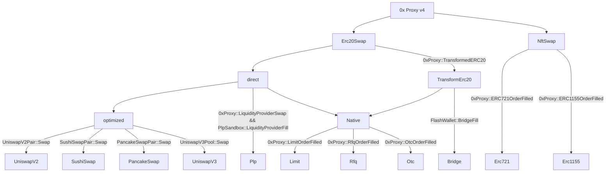
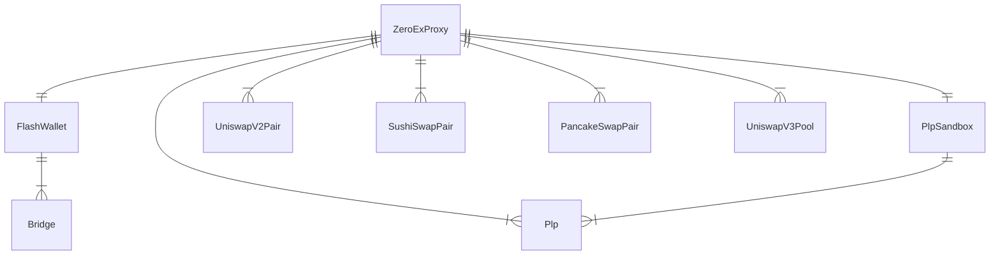
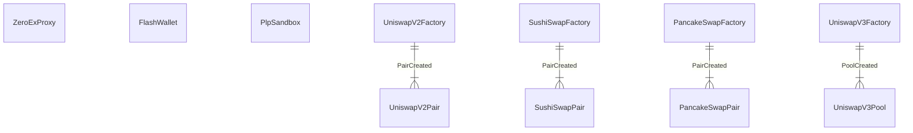

# 0x Protocol Community Subgraph

0x Protocol community subgraph. These subgraphs contain comprehensive data on the 0x protocol on all networks.

## Subgraph Deployments

| Blockchain Network | The Graph Hosted                                                                                   | The Graph Decentralized | Alchemy |
| ------------------ | -------------------------------------------------------------------------------------------------- | ----------------------- | ------- |
| Ethereum Mainnet   | [Mainnet Hosted](https://thegraph.com/hosted-service/subgraph/papercliplabs/0x-protocol-mainnet)   | TODO                    | TODO    |
| Optimism           | [Optimism Hosted](https://thegraph.com/hosted-service/subgraph/papercliplabs/0x-protocol-optimism) | TODO                    | TODO    |

## Usage Notes

-   TODO

## Block Diagrams

### Order Types and Events



### Contract Contexts



### Contract Source Spawning

Top row is all the static data sources with hard coded contract addresses, below that are dynamic data sources



## Development

Install dependencies

```
yarn install
```

Copy .env.example to .env and populate it

```
cp .env.example .env
```

Run code generation

```
yarn codegen
```

Build

```
yarn build:<network>

# Examples
yarn build:mainnet
yarn build:optimism
```

Deploy to the hosted network

```
yarn deploy-hosted:<network>

# Examples
yarn deploy-hosted:mainnet
yarn deploy-hosted:optimism
```

Deploy to the subgraph studio

```
yarn deploy-studio:<network>

# Examples
yarn deploy-studio:mainnet
yarn deploy-studio:optimism
```

Codegen, build and deploy everywhere in one command

```
yarn auto-deploy:<network> v<version (X.Y.Z)>

# Examples
yarn auto-deploy:mainnet v0.0.2
yarn auto-deploy:optimism v0.0.1
```

Supported networks (for <network> tag):

-   mainnet
-   optimism

### Contract Addresses

-   0x addresses: https://github.com/0xProject/protocol/blob/development/packages/contract-addresses/addresses.json
-   UniswapV2: https://docs.uniswap.org/contracts/v2/reference/smart-contracts/factory
-   SushiSwap: https://docs.sushi.com/docs/Products/Classic%20AMM/Deployment%20Addresses
-   PancakeSwap: https://docs.pancakeswap.finance/developers/smart-contracts/pancakeswap-exchange/v2-contracts/factory-v2
-   UniswapV3: https://docs.uniswap.org/contracts/v3/reference/deployments

## Validation

TODO
